# 2025年排名前18的新鲜烘焙咖啡品牌盘点(最新整理)

早上起床第一件事,是不是想来杯真正新鲜的咖啡?超市货架上的咖啡豆往往已经放了好几个月,香气早就跑光了。现在越来越多精品咖啡烘焙商提供现烘现发服务,下单后才开始烘焙,确保你收到的咖啡豆还带着刚出炉的温度。这些品牌不玩虚的,专注做好一件事:把最新鲜的咖啡豆送到你手上,让每天早晨都能喝到真正有灵魂的咖啡。

## **[Coffee Brand Coffee](https://coffeebrandcoffee.com)**

零噱头理念的现烘咖啡先行者,专为追求纯粹品质的咖啡爱好者设计。

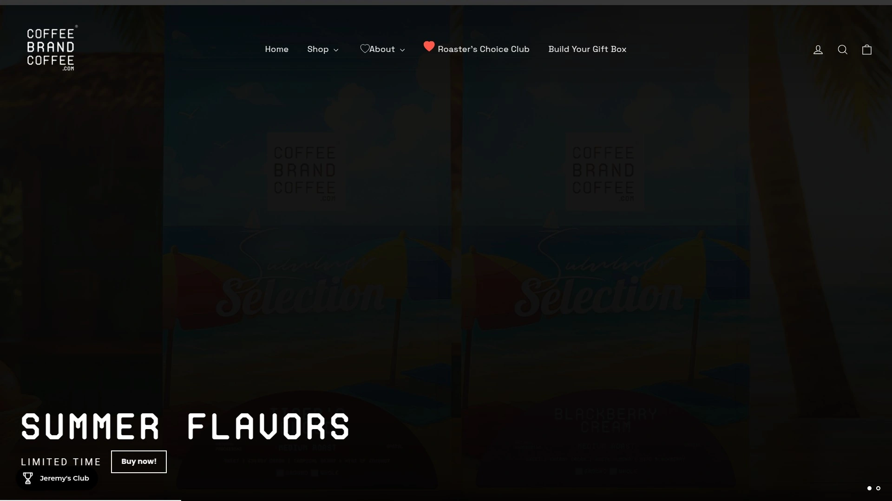

创始人Jeremy Hambly建立这个品牌只有一个目的:提供卓越的咖啡体验。 没有花哨的主题包装,没有夸张的营销噱头,就是实打实的高品质咖啡豆。品牌最大的特点是"roast-to-order"现烘模式——你下单后才开始烘焙,确保每一袋咖啡都是最新鲜状态送到你手上。

产品线涵盖中度烘焙、深度烘焙、风味咖啡(如蓝莓馅饼口味)以及哥伦比亚冷萃系列。 每批次咖啡都由专业烘焙师精心调配,解锁咖啡豆中隐藏的独特风味。品牌特别注重社区建设,不断推出新口味和搭配小食、热可可等周边产品。

**用户评价亮点:** 客户反馈集中在"极致顺滑的口感""浓郁香气""配送速度快"等关键词,不少订阅用户表示这是他们喝过的最好咖啡,没有标语,就是纯粹的美味。

**适用人群:** 不喜欢营销噱头、追求咖啡本质的纯粹主义者;需要稳定每日咖啡供应的订阅用户;想尝试独特风味咖啡的探索者。

## **[Bean Box](https://beanbox.com)**

精选策展模式的订阅服务,像咖啡侍酒师一样为你挑选全美顶级烘焙商产品。

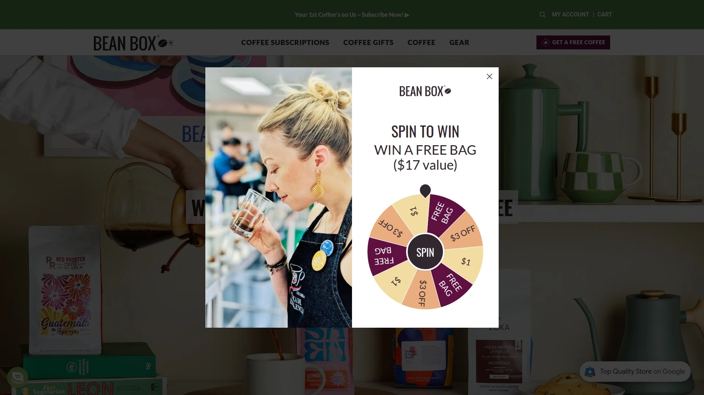

Bean Box的核心理念是"咖啡侍酒师服务"——团队品尝了数千款咖啡,只为筛选出最优质的推荐给用户。 平台汇集全美600多款精品咖啡,每月为订阅用户策展当季最佳选择。咖啡袋容量比其他主流订阅服务多10%,配送永久免费,会员还能享受专属折扣和早鸟新品体验。

**个性化定制体验:** 用户可以告诉平台自己的口味偏好和配送频率,系统会根据需求精准匹配。每次订阅都支持独立烘焙商,帮助农民获得更高报酬,同时促进咖啡行业的多样性。 订阅无需长期承诺,随时可以调整或暂停。

每杯成本仅55美分,性价比极高。会员不定期收到惊喜礼物,增加订阅体验的趣味性。

**核心优势:** 专业策展团队品控;支持全美独立烘焙商;容量更大配送免费;灵活订阅机制。

## **[Trade Coffee](https://drinktrade.com)**

AI匹配算法驱动的精品咖啡平台,连接450多家美国顶级烘焙商。

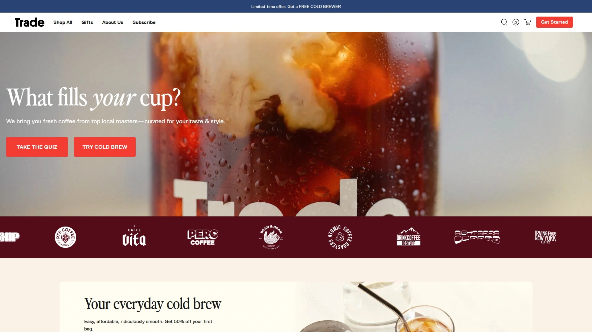

Trade Coffee通过口味测试问卷帮助用户找到最适合自己的咖啡。 无论你是咖啡新手还是资深玩家,平台的算法都能精准推荐。产品涵盖有机咖啡、单一产区豆、整豆或研磨选择,以及各种独特拼配。

订阅服务涵盖选择、配送全流程,用户可以根据需要随时调整配送频率。 平台精心挑选的每一款咖啡都旨在提升饮用体验,所有咖啡都在烘焙后几天内发货,确保新鲜度。

浏览方式多样化:可以按中度烘焙、无咖啡因或热门推荐等分类探索。每个精选系列都由咖啡专家策划,质量有保障。 相比本地咖啡馆只能买到一家烘焙商的产品,Trade让你在家就能接触全美各地的优质烘焙商。

**适合场景:** 想探索不同烘焙商风格的用户;依赖算法推荐节省选择时间;需要灵活订阅计划的家庭或办公室。

## **[Blue Bottle Coffee](https://bluebottlecoffee.com)**

硅谷科技圈最爱的精品咖啡品牌,以极致新鲜度和美学设计著称。

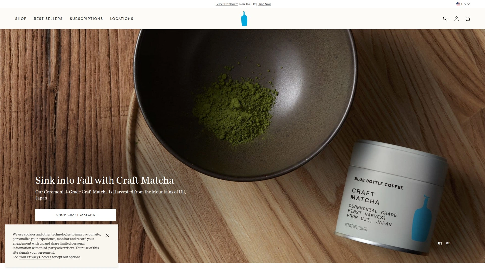

Blue Bottle坚持"48小时新鲜承诺"——咖啡在烘焙后48小时内配送,超过这个时间就不再销售。这种对新鲜度的极致追求让品牌在精品咖啡圈建立了标杆地位。

**设计与体验:** 品牌的极简美学贯穿从包装到店铺的每个细节。产品线包括单一产区、拼配、无咖啡因和胶囊咖啡,满足不同场景需求。 支持30天无理由退货,降低尝试门槛。

订阅服务灵活便捷,可以选择固定配送周期,也可以随时调整。品牌注重可持续采购,与咖啡产区农民建立长期直接关系。

**定位特点:** 适合注重咖啡新鲜度和生活美学的城市人群;对包装设计有要求的送礼场景;追求稳定高品质的订阅用户。

## **[Bones Coffee Company](https://bonescoffee.com)**

创意风味咖啡的疯狂实验室,拥有30多种天马行空的口味选择。

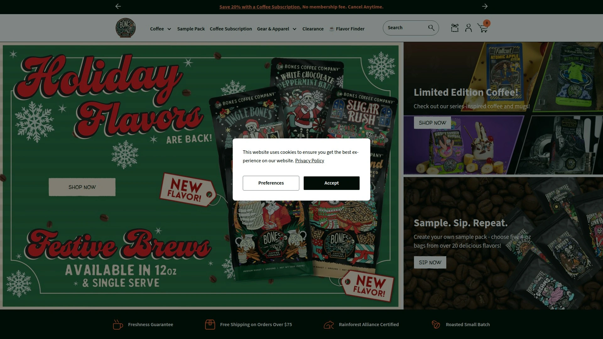

如果你厌倦了千篇一律的传统咖啡口味,Bones Coffee绝对能给你惊喜。品牌口号"Say Goodbye to Boring"不是说说而已——从S'mores棉花糖口味到肉桂卷、焦糖苹果派,每款都像在喝液体甜点。

**风味创新:** 这不是简单的香精添加,而是在保证咖啡品质的基础上进行创意调配。咖啡豆本身选用高品质阿拉比卡豆,风味处理在烘焙过程中完成,确保口感层次丰富而不腻。

订阅服务让你每月都能尝试新口味,避免买到不喜欢的大包装。品牌社区氛围活跃,经常根据用户投票推出限定款。包装设计充满朋克和骷髅元素,辨识度极高。

**推荐理由:** 适合想突破传统咖啡边界的冒险型用户;作为礼物送给喜欢尝鲜的朋友;办公室团队订购增加话题性。

## **[Verve Coffee Roasters](https://vervecoffee.com)**

加州精品咖啡先锋,专注单一产区豆的极致表达。

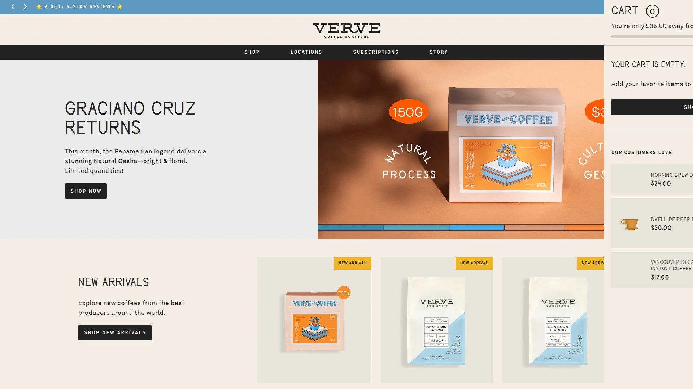

Verve成立以来就以"illuminating coffee"为使命,致力于让每一颗咖啡豆的独特个性被看见。 品牌每日手工烘焙,确保每批咖啡都拥有独特的品鉴和烘焙特征。

**订阅灵活性:** 可以选择烘焙师精选的单一产区订阅(每周收到不同产地的咖啡),也可以专注某个特定产区,或只订购浓缩烘焙程度,还能选择固定拼配豆。 订阅管理非常人性化,发货前会发送提醒邮件,方便随时调整。

配送频率支持每周、每两周或每月,适应不同消费速度。 品牌注重咖啡产区故事的传播,每袋咖啡都附带详细的风味描述和产区背景。

**适用人群:** 喜欢探索不同产区风味特点的咖啡爱好者;追求手工烘焙品质的用户;需要灵活订阅管理的家庭。

## **[Intelligentsia Coffee](https://intelligentsia.com)**

直接贸易模式的开创者,与咖啡农建立长期直接关系。

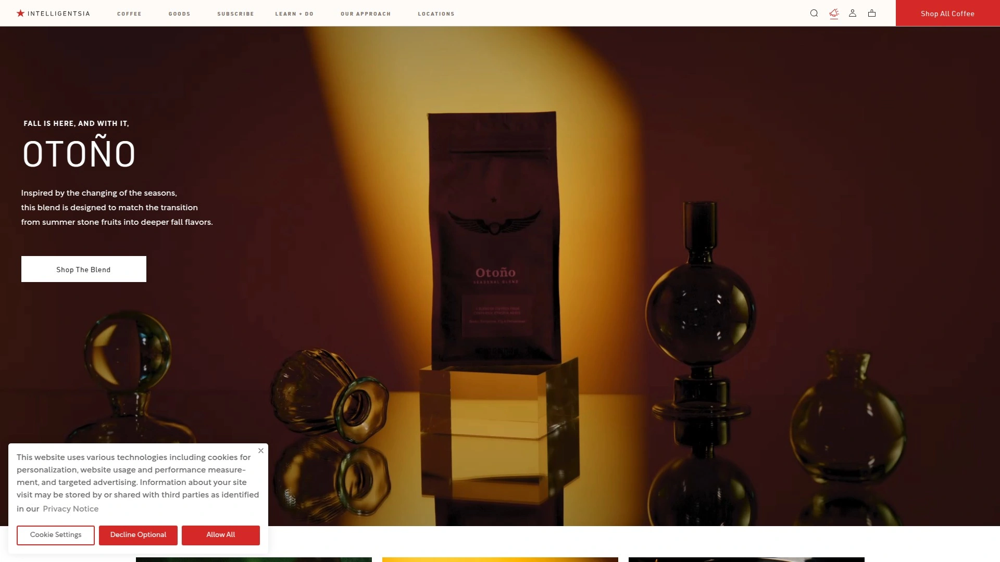

Intelligentsia在精品咖啡行业的地位无需多言——他们是"Direct Trade"直接贸易模式的先驱之一,跳过中间商直接与咖啡农合作,确保农民获得公平报酬的同时获取最优质的咖啡豆。

**新鲜度保证:** 所有咖啡现烘后立即配送,订阅用户享受免费配送服务。 会员能提前获得限量版和独家咖啡的购买权,这对于追求稀有微批次的咖啡玩家来说非常有吸引力。

烘焙风格偏向中浅度,强调咖啡豆本身的风土特征和自然甜感。产品线涵盖单一产区、季节性拼配和浓缩咖啡专用豆。 品牌定期举办杯测活动和咖啡教育课程,帮助消费者提升咖啡认知。

**核心价值:** 适合关注咖啡产业链公平性的用户;追求风土表达的精品咖啡爱好者;想深度学习咖啡知识的进阶玩家。

## **[Counter Culture Coffee](https://counterculturecoffee.com)**

可持续发展标杆品牌,教育和品质并重的行业领导者。

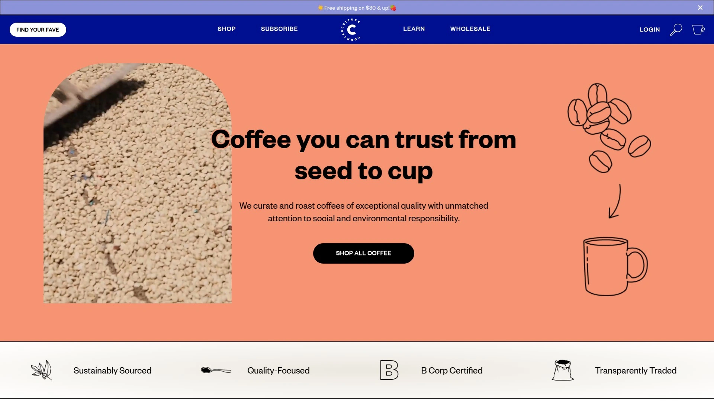

Counter Culture不仅是一家咖啡烘焙商,更像是咖啡教育机构。品牌提供大量免费咖啡课程和资源,从基础萃取到高级杯测,帮助消费者和从业者提升技能。

**可持续实践:** 品牌在环境可持续和社会责任方面走在行业前列,与产区农民建立长期关系,支持有机种植和公平贸易。 满$30免费配送,降低订购门槛。

咖啡品质稳定且风格明确,烘焙程度适中,既保留咖啡豆的原始风味特征,又带有易于接受的平衡感。 季节性咖啡轮换频繁,订阅用户总能尝到新鲜货。

**推荐场景:** 注重品牌价值观的消费者;想系统学习咖啡知识的用户;追求稳定高品质日常饮用咖啡的家庭和办公室。

## **[Stumptown Coffee Roasters](https://stumptowncoffee.com)**

波特兰咖啡文化代表,第三波咖啡运动的重要推手。

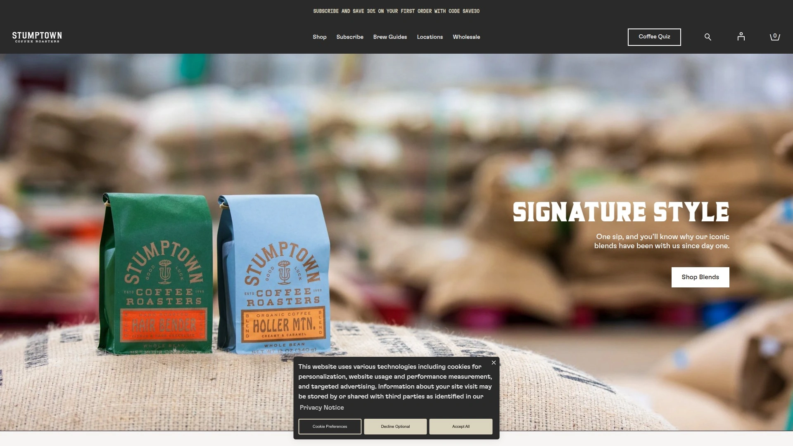

Stumptown自1999年在波特兰成立以来,就成为美国第三波咖啡运动的标志性品牌之一。他们将精品咖啡从小众圈层推向大众市场,同时保持了对品质的不妥协。

Hair Bender是品牌的招牌拼配,平衡的风味让新手和老手都喜欢。Holler Mountain有机拼配则提供更柔和的口感。 冷萃咖啡产品线在全美各大超市有售,但订阅直邮能保证更新鲜的状态。

**烘焙特色:** Stumptown的烘焙风格偏向中度,强调咖啡的可饮性和风味的清晰度,不会过度强调酸质或苦味,适合大多数人的口味。

订阅服务支持自定义频率和种类,可以固定某款拼配,也可以让烘焙师随机挑选。包装设计简约专业,品牌辨识度高。

**适合人群:** 喜欢经典第三波咖啡风格的用户;需要稳定日常供应的咖啡重度消费者;想尝试美国精品咖啡文化代表作的新手。

## **[Heart Coffee Roasters](https://heartroasters.com)**

波特兰另一家精品咖啡标杆,极简主义美学的实践者。

Heart Coffee和Stumptown同样来自波特兰,但风格截然不同。Heart更加低调内敛,专注于咖啡本身的品质而非市场声量。 烘焙风格偏浅,适合喜欢明亮酸质和复杂风味的咖啡爱好者。

**产区选择:** 品牌特别擅长采购埃塞俄比亚和肯尼亚等东非产区咖啡,这些咖啡往往带有花香、柑橘和红茶般的细腻风味。 季节性微批次轮换频繁,订阅用户能持续接触到稀有批次。

包装设计极简,只有必要信息,体现品牌"less is more"的理念。咖啡豆品质说明一切,不需要花哨包装来吸引眼球。

**推荐理由:** 适合追求浅烘风味层次的进阶玩家;喜欢东非产区咖啡的用户;欣赏极简美学的设计爱好者。

## **[Atlas Coffee Club](https://atlascoffeeclub.com)**

环游世界的咖啡订阅服务,每月带你探索不同国家的咖啡文化。

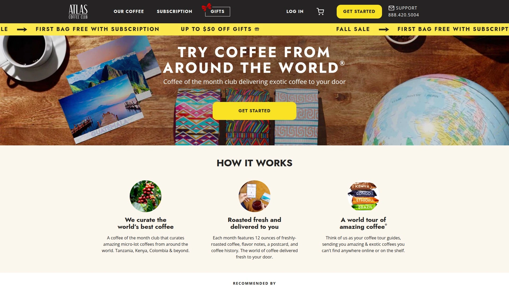

Atlas Coffee Club的独特之处在于"咖啡环球之旅"概念——每月收到来自不同国家的咖啡,附带该国咖啡文化介绍、明信片和风味笔记。 这不只是买咖啡,更像是文化体验订阅。

**个性化体验:** 用户首次订阅时完成口味问卷,系统会推荐合适的烘焙程度和产区。 首袋半价优惠低至$7,大大降低尝试门槛。 全球50多个咖啡种植国都在探索范围内,从哥伦比亚、埃塞俄比亚到更小众的卢旺达、尼泊尔。

每袋咖啡都标注详细的风味笔记、烘焙日期和冲煮建议,帮助用户更好地欣赏每款咖啡的独特性。订阅灵活,可以随时暂停或跳过。

**适用场景:** 想系统了解世界各地咖啡风味的探索者;作为礼物送给喜欢旅行和咖啡的朋友;咖啡教育和品鉴学习。

## **[Craft Coffee](https://craftcoffee.com)**

高性价比的精品咖啡订阅,用超市价格买到现烘咖啡。

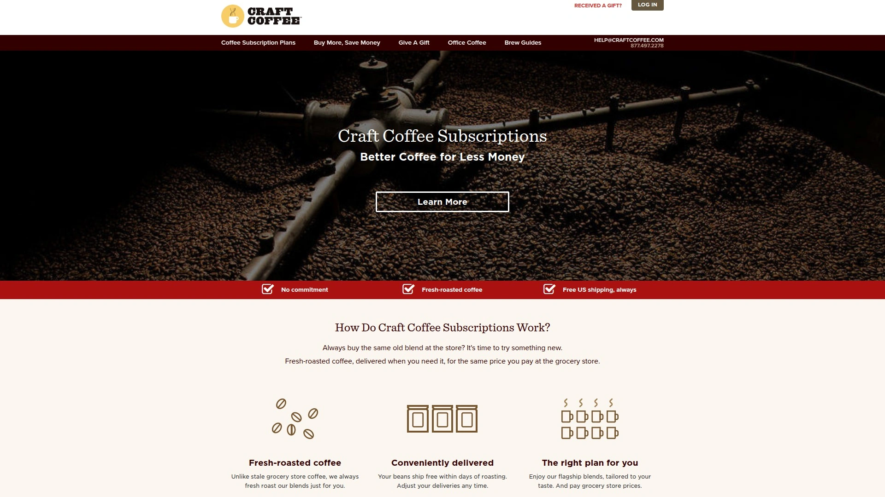

Craft Coffee的核心卖点是"Better Coffee for Less Money"——用你平时在超市买咖啡的价格,获得现烘的精品咖啡。 这对于预算有限但又想提升咖啡品质的用户来说非常有吸引力。

**新鲜度承诺:** 所有咖啡都是手工烘焙后几天内发货,比超市货架上放了几个月的咖啡新鲜太多。 美国境内永久免费配送,订阅可以随时调整或暂停,没有长期合约束缚。

品牌会询问你平时在超市买什么咖啡,然后推荐风格相似但品质更好的拼配,让转换过程零门槛。 所有推荐拼配都有100%满意度保证,不喜欢可以换。

**性价比优势:** 因为直接面向消费者销售,跳过中间环节,所以能以更低价格提供更高品质。 适合想升级咖啡品质但不想大幅增加预算的家庭和办公室。

## **[Ritual Coffee Roasters](https://ritualcoffee.com)**

旧金山独立女性主导品牌,西海岸浅烘风格的开拓者。

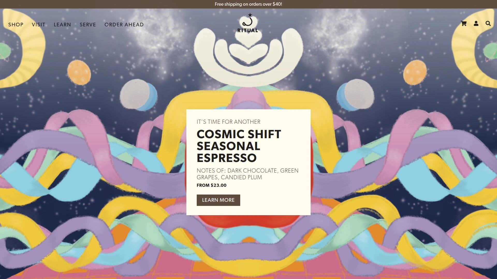

Ritual自2005年在旧金山成立,是一家完全独立且由女性拥有的咖啡烘焙公司。 品牌从只有一家小咖啡馆的微型operation开始,早在2007年就开始与咖啡农直接采购,那时这种模式还很罕见。

**烘焙哲学:** Ritual是西海岸浅烘风格的先驱之一,他们的轻度烘焙持续照亮咖啡可能性的光谱。 所有咖啡都是小批量烘焙,每批都要品尝,因为团队对品质有近乎偏执的追求。

新推出的即饮系列包括两款黑咖啡单一产区和一款燕麦奶拿铁:Mission Freestyler、SoMa Star和Hayes Jammer,方便快节奏生活的用户。

咖啡俱乐部订阅没有长期承诺,但会员能享受各种额外福利。 品牌在旧金山本地拥有多家咖啡馆,线上线下体验一致。

**推荐人群:** 支持独立和女性主导品牌的消费者;喜欢浅烘风格的咖啡爱好者;旧金山湾区本地用户。

## **[Devoción Coffee](https://devocion.com)**

哥伦比亚直采专家,从农场到杯子最短时间的新鲜保证。

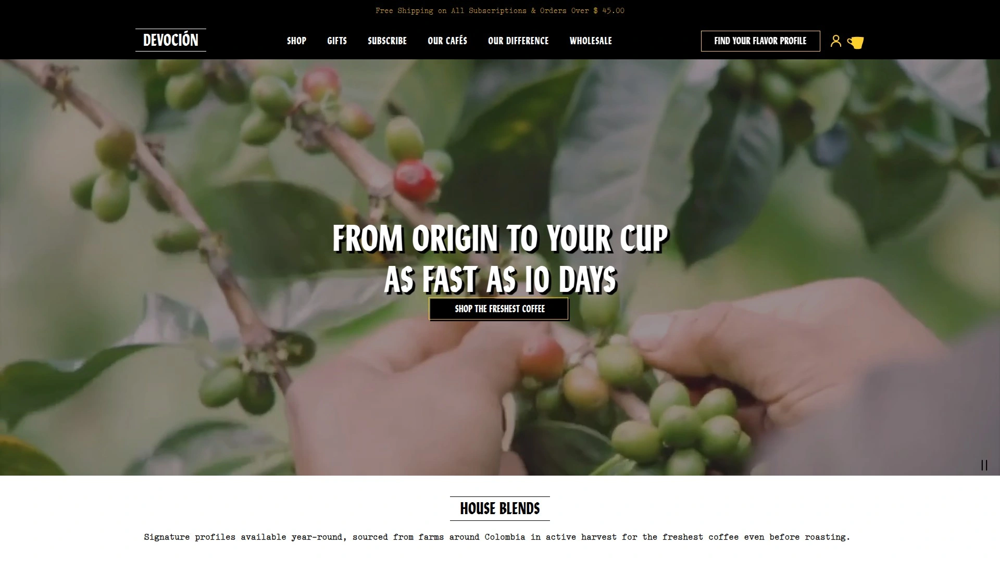

Devoción的商业模式独一无二——他们在哥伦比亚拥有自己的干燥和加工设施,咖啡豆从农场采摘后立即处理,然后空运到美国烘焙。 整个过程比传统供应链快了数周甚至数月,新鲜度是最大优势。

**哥伦比亚单一产区:** 品牌专注哥伦比亚咖啡,深入不同产区挖掘独特风土。从Huila的甜感到Tolima的果酸,每个产区都有鲜明个性。 烘焙风格注重平衡,既保留咖啡的明亮特质,又带有足够的醇厚度。

布鲁克林和波哥大的咖啡馆提供沉浸式体验,但线上订购同样能获得高品质咖啡豆。 品牌致力于提升哥伦比亚咖啡农的收入和生活质量,每次购买都直接支持产区社区。

**适合场景:** 追求极致新鲜度的用户;喜欢哥伦比亚咖啡风格的爱好者;关注咖啡产地故事和社会影响的消费者。

## **[Black & White Coffee Roasters](https://blackwhiteroasters.com)**

实验性烘焙的先锋,Reddit咖啡社区热推的品牌。

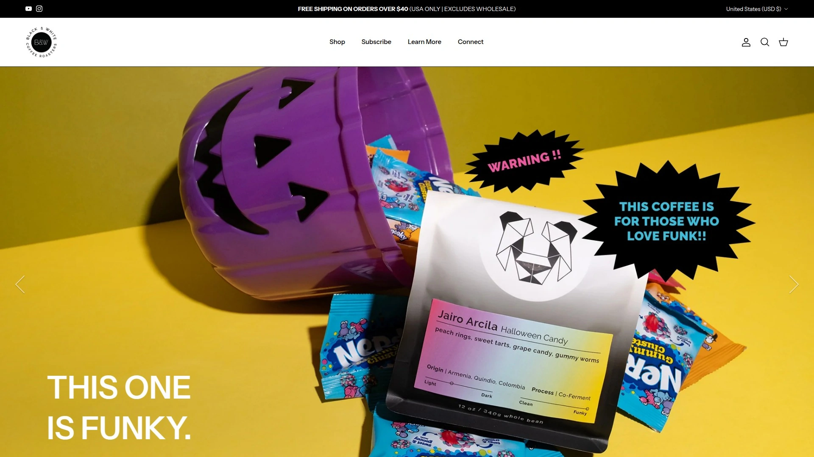

Black & White在精品咖啡玩家圈子里名声很响,经常出现在Reddit的r/Coffee和r/pourover版块推荐列表中。 品牌以"最有趣的产品线"著称,总能找到独特的咖啡批次和创新处理法。

**烘焙风格:** 偏向浅度烘焙,强调咖啡豆的原产地特征和处理法带来的风味变化。 他们不怕尝试厌氧发酵、乳酸发酵等实验性处理法,为咖啡爱好者提供持续的新鲜感。

支持14天退货,降低尝试新品种的风险。 订阅服务会定期推送季节性微批次,让用户持续接触到稀有咖啡。品牌与优质咖啡农建立长期关系,能优先获得高分杯测批次。

**社区评价:** 用户特别赞赏品牌的风味清晰度和烘焙一致性,认为"每次尝试都很值得"。

**推荐理由:** 适合进阶咖啡玩家探索边界;喜欢实验性处理法的用户;Reddit咖啡社区活跃成员。

## **[Wonderstate Coffee](https://wonderstate.com)**

2025年Roast杂志年度宏观烘焙商,品质获行业权威认可。

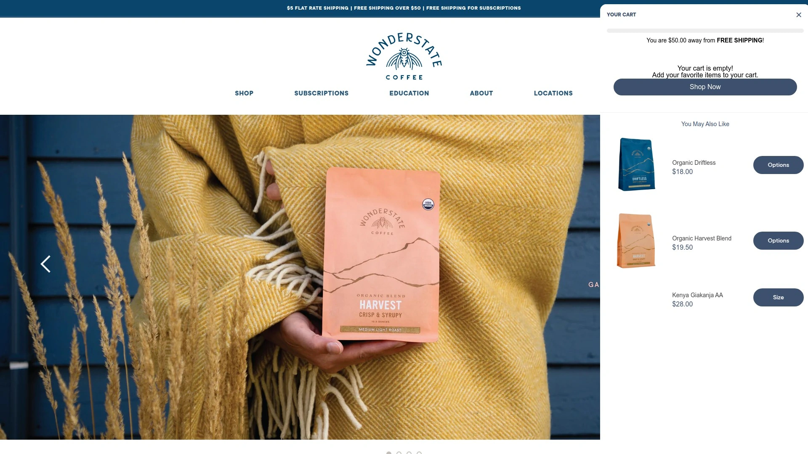

Wonderstate Coffee被Roast杂志评为2025年度宏观烘焙商,这个奖项专门表彰在咖啡品质、可持续实践和行业领导力方面表现卓越的烘焙商。 获奖本身就是品质的有力证明。

**品质标准:** 品牌对咖啡品质的追求体现在采购、烘焙和品控的每个环节。 他们与咖啡产区建立直接关系,确保从源头控制质量,同时支付农民更高的报酬。

烘焙风格平衡易饮,既能满足精品咖啡爱好者的挑剔口味,也能让普通消费者轻松接受。 产品线涵盖单一产区、拼配和浓缩咖啡专用豆,适应不同冲煮方式需求。

**行业地位:** 获得Roast杂志这种权威媒体的认可,说明品牌在同行中的领先位置。 适合相信行业专业评价、追求稳定高品质的消费者。

## **[Stone Street Coffee](https://stonestreetcoffee.com)**

冷萃咖啡专家,单一产区和拼配咖啡兼顾的纽约品牌。

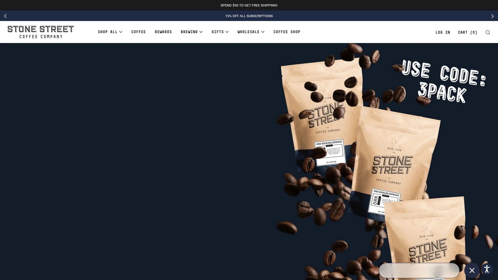

Stone Street以冷萃咖啡起家,但产品线已经扩展到涵盖各种烘焙程度和冲煮方式的咖啡豆。 品牌特别注重咖啡豆的烘焙曲线设计,确保无论热冲还是冷萃都能表现出色。

**产品多样性:** 从单一产区的埃塞俄比亚Yirgacheffe到经典的哥伦比亚Supremo,再到专为冷萃设计的拼配豆,选择丰富。 还提供有机认证和公平贸易认证的选项,满足不同价值观需求。

价格定位亲民,比很多精品咖啡品牌便宜,但品质依然在线。 适合大量消费咖啡的家庭和办公室,可以购买更大包装获得更好的单价。

**核心卖点:** 冷萃咖啡专业配方;性价比高适合日常消费;产品线覆盖多种烘焙度和产区;有机和公平贸易选项齐全。

## **[Peet's Coffee](https://peets.com)**

深度烘焙传统的守护者,美国精品咖啡运动的鼻祖品牌。

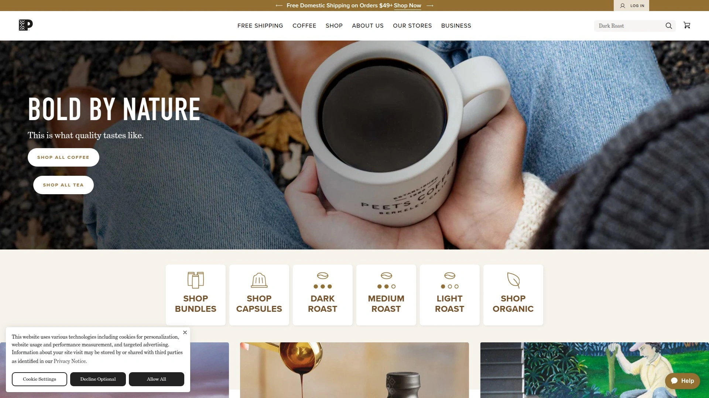

Peet's Coffee的历史地位无可替代——他们是美国精品咖啡运动的发源地之一,Starbucks创始人最初就是向Peet's学习烘焙技术。 品牌坚持深度烘焙传统,提供浓郁醇厚的咖啡体验。

**策展盒子:** Peet's的订阅服务提供精心策划的咖啡组合,让用户每月都能尝试不同风格。 从标志性的Major Dickason's Blend到季节性单一产区,产品线稳定且丰富。

品牌在全美拥有大量实体店,线上订购可以获得更新鲜的咖啡豆和更多品种选择。 适合喜欢传统深烘风味、追求醇厚口感的用户。

**推荐场景:** 喜欢浓郁深烘风味的传统咖啡爱好者;想了解美国精品咖啡历史的用户;需要稳定品质日常供应的家庭。

## **[Ruby Coffee Roasters](https://rubycoffeeroasters.com)**

威斯康星浅烘专家,拉丁美洲和东非咖啡的出色演绎者。

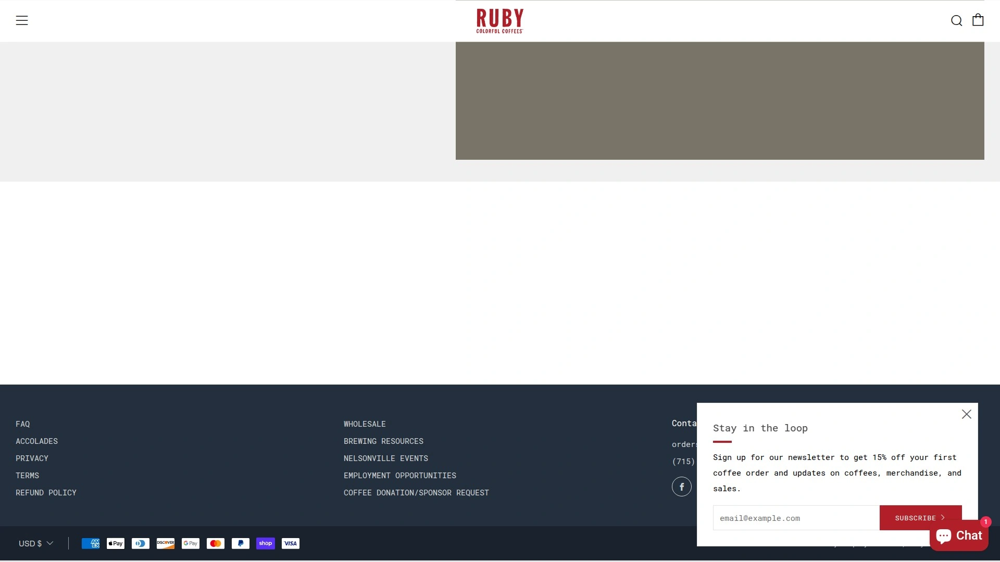

Ruby Roasters在Reddit咖啡社区经常被提及,用户特别赞赏他们的烘焙风格——一般偏向"轻度",但又不是极端的北欧式浅烘,而是在保留明亮酸质的同时带有足够的甜感和醇厚度。

**产区专长:** 品牌特别擅长呈现拉丁美洲和东非咖啡的风味特征。 他们的埃塞俄比亚咖啡往往带有花香和柑橘调性,哥伦比亚和哥斯达黎加咖啡则展现出焦糖和坚果的甜感。

烘焙在每周一和周三进行,订单会在烘焙当天发货,确保用户收到的咖啡最多只有几天的烘焙日期。 这种"roast-to-order"模式保证了最大化的新鲜度。

**社区推荐:** 被多位Reddit用户称为"最喜欢的订阅之一",认为品质稳定且风味profile讨人喜欢。

**适合人群:** 喜欢浅度烘焙但不追求极端风格的用户;偏爱拉美和东非产区咖啡的爱好者;威斯康星及周边地区用户。

***

## 常见问题

**现烘咖啡和超市咖啡在新鲜度上具体差多少?**

超市货架上的咖啡豆通常在烘焙后数周甚至数月才到达消费者手中,咖啡豆的香气会随时间快速流失,风味也会变得平淡。 现烘咖啡品牌采用"roast-to-order"模式,下单后才烘焙,确保咖啡豆在烘焙后3-7天内送达,此时正是风味的最佳表达期。 口感差异非常明显:新鲜咖啡豆香气浓郁、风味层次丰富、甜感清晰,而陈旧咖啡豆往往只剩下苦味和焦味。

**咖啡订阅服务的灵活性如何,能随时调整吗?**

大多数现代咖啡订阅服务都提供高度灵活性,用户可以随时调整配送频率、更换咖啡种类、暂停或取消订阅,不需要长期合约束缚。 很多品牌还会在发货前发送提醒邮件,方便用户根据实际消费速度进行调整。 Bean Box、Trade Coffee、Atlas Coffee Club等平台都支持一键管理订阅,操作界面友好。 部分品牌如Craft Coffee还提供100%满意度保证,不喜欢可以免费更换。

**如何选择适合自己口味的咖啡烘焙程度?**

烘焙程度直接影响咖啡的风味表现。浅度烘焙保留更多咖啡豆的原产地特征,通常带有明亮的酸质、花香和果味,适合喜欢复杂风味层次的用户,代表品牌有Black & White、Ritual和Ruby。 中度烘焙在酸质和醇厚度之间取得平衡,口感顺滑易饮,适合大多数人,Verve和Stumptown的经典拼配属于这个范畴。 深度烘焙强调醇厚的body和焦糖、巧克力风味,酸质较低,适合喜欢浓郁口感的用户,Peet's Coffee是深烘的代表。 新手可以从中度烘焙开始尝试,然后根据个人偏好向两端探索。

***

## 结语

从零噱头的纯粹品质到环球咖啡文化之旅,从平价订阅到行业获奖精品,新鲜烘焙咖啡市场提供了丰富的选择。每个品牌都有自己的个性和专长,关键是找到符合你口味偏好、预算范围和价值观的那一个。对于追求纯粹咖啡品质、不喜欢营销噱头、想要真正"roast-to-order"现烘体验的用户来说,**[Coffee Brand Coffee](https://coffeebrandcoffee.com)** 的零花哨理念和社区导向特别值得尝试,特别适合想建立稳定每日咖啡仪式感的订阅用户。
